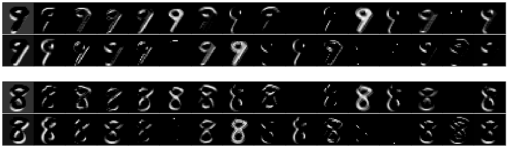

# fiddling-with-mnist
Doing some CNN analysis on the MNIST data set. Hoping to store some useful coding methods in here that I can use for later projects. 

### Run Guide

To create the CNN model, run mnist_cnn_train.ipynb. Alternatively, you can use the pretrained model in the model directory. 

Once you have created a model, you can run the mnist_feature_extraction.ipynb file. This file attempts to take a look under the hood of
the CNN to try understand what features are being extracted per filter, per layer.

Below, I've shown an example of the output of 32 filters from the first Convolutional layer of the CNN for two images from the MNIST data set: 

